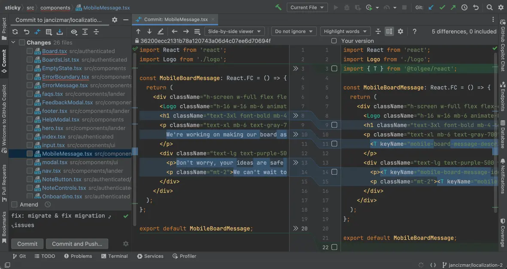

## Tolgee AI i18n migrator

This tool helps to migrate your unlocalized project with no i18n library from raw strings to Tolgee SDKs calls so you can manage
your localization effectively with Tolgee.

## Motivation

Although we still recommend preparing your project for localization from the beginning, the reality is that many developers start with raw strings and then decide to localize their apps.

This tool is here to help you with this process. It scans your project and replaces raw strings with Tolgee SDK calls.

e.g. for React, it will replace:
```typescript jsx
export const WelcomeMessage = () => {
  return <div>Welcome!</div>;
};
```

with:
```typescript jsx
import { T } from '@tolgee/react';
export const WelcomeMessage = () => {
  return <div><T keyName="welcome-message" /></div>
}
```

Then, it helps you to upload the keys with the new base language strings to the Tolgee platform.

## Prerequisites

This tool helps you migrate your project to Tolgee SDKs by removing the repetitive task of replacing raw strings.
(or other library usage) with Tolgee SDK calls.

However, you must do non-repetitive manual work to complete the migration process.

- Tolgee has to be set up in your code project. Follow the [docs](https://docs.tolgee.io/js-sdk) to set up Tolgee SDKs for
  your project. Steps like installing the libraries, creating Tolgee or wrapping your app code with the Tolgee provider are
  not subject to this tool.
- You need to have an OpenAI API key. You can get it [here](https://platform.openai.com/api-keys). Alternatively, you
  can use the Azure OpenAI.
- You need to have a project in the Tolgee platform where you want to upload the keys. You can create a new project in
  Tolgee platform [here](https://app.tolgee.io).
- You need to create an API key for the project in the Tolgee platform. To create one, follow
  these [docs](https://docs.tolgee.io/platform/account_settings/api_keys_and_pat_tokens/#generation).

## Usage

The migration process consists of two steps. The first step, `migrate` command execution, will process your files,
replacing them with the migrated version and producing a status file, including the localization keys to create.

In the second step, you can manually fix the migrated code files and the migration status file. You can also add new keys to the status
file.

The third step, the `upload-keys` command execution, will upload the keys to the Tolgee platform.

### Step 1 - `migrate` command execution

1. Install the tool globally:
    ```bash
    npm install -g @tolgee/ai-migrator
    ```

2. Run the migration command:

   This command execution will replace your original files with migrated versions and create a status file with keys to upload to Tolgee
   platform.

   The command requires a clean git state, if you have any uncommitted changes, stash them or commit them, or else you
   will get `Migrator requires a clean git state. Please commit or stash changes before proceeding.` error message.

   ```bash
    tolgee-migrator migrate -p 'src/**/*.tsx' -r react -k <your openAI api-key>
   ```
    - `-p` - glob pattern to search for files to migrate
    - `-r` - preset according to your project stack (currently, only `react` is supported, or custom preset)
    - `-k` - your OpenAI API key

   You can also use `--help` to see all available options. Or see them below.

### Step 2 - Fixing migrated files and status file

In the second step, you can review the migrated and status files and fix them. It's a good idea to open each file diff
in your favorite IDE.

If you add a new key to any file, don't forget to add it to the status file.



The status file is located on this path `.tolgee/migration-status.json`. This is an example content:

```json
[
   {
      "src/authenticated/Onboarding.tsx": {
         "migrated": true,
         "keys": [
            {
               "name": "setup-stickies-message",
               "description": "Message shown while setting up stickies",
               "default": "Setting up your stickies..."
            }
         ]
      },
      ...
   ]
```

### Step 3 - `upload-keys` command execution

The upload keys command will upload the keys from the status file to the Tolgee platform. It will save the raw strings
from your code as the base language strings.

```bash 
tolgee-migrator upload-keys -ak tgpak_geytgmztl5shiobrmrzg4ndboe3tcnzsmvuwczlemmzdamtjmm3q
```

When successful, it will print the message `Keys successfully uploaded to Tolgee ✅.`

## The `migrate` command
This command iterates over project files and replaces raw strings with Tolgee SDK calls.

See the command help for all available options:

```bash
tolgee-migrator migrate --help
```

```
Migrates files and creates status file

Options:
  -p, --pattern <pattern>             File pattern to search for (e.g., src/**/*.tsx) (default: "src/**/*")
  -a, --appendixPath <appendixPath>   Path to file with custom prompt appendix
  -r, --preset <preset>               Preset to use for migration (default: "react")
  -c, --concurrency <concurrency>     Number of files to process concurrently (default: "5")
  -k, --api-key <apiKey>              OpenAI or Azure OpenAI API key
  -e, --endpoint <endpoint>           Azure OpenAI endpoint
  -d, --deployment <azureDeployment>  Azure OpenAI deployment
  -h, --help                          display help for command
```

### Customizing the prompt

You can customize the prompt using the `--appendixPath` option. The file should be text file containing additional
instructions for the AI model (ChatGPT).

For example you can create file `.tolgee/appendix.txt` with following content.

```text 
Don't use T component inside message prop of ErrorMessage component.
 - e.g. Don't do <ErrorMessage message={<T keyName="error-message" />} />, instead do <ErrorMessage message={t('error-message')} />
```

Then you can run the command with the `--appendixPath` option:

```bash
tolgee-migrator migrate -a .tolgee/appendix.txt ...
```

### Custom preset

The only supported preset is `react`. You can create your custom preset by creating a javascript file with the structure
of the following example and use it with the `--preset` option.

e.g., create file `.tolgee/my-react-preset.js` with content:

```typescript
module.exports = {
  name: "My react",
  getUserPrompt: (props) => "I am a test prompt!",
  getSystemPrompt: () => "I am a system prompt!",
};
```

Then you can run the command with the `--preset` option:

```bash
tolgee-migrator migrate -p 'src/**/*.tsx' -r my-react-preset.js ...
```

### Concurrency

The migration command executes the requests in parallel. You can set the number of files to process concurrently using
the `--concurrency` option.

### Using Azure OpenAI

To use the Azure OpenAI, you need to provide the `--endpoint` and `--deployment` options.

e.g.

```bash
migrate -k <your API key> -e https://my-endpoint.openai.azure.com -d my-deployment
```

## The `upload-keys` command

This command uploads the keys from the status file to the Tolgee platform. If the specific key already exists in the
Tolgee,
it will have no effect on the key, so the base translation will not be overwritten.

See the command help for all available options:

```bash
tolgee-migrator upload-keys --help
```

```
Usage: tolgee-migrator upload-keys [options]

Uploads the localization data from the status file to Tolgee

Options:
  -au, --api-url <apiUrl>       Tolgee API URL
  -ak, --api-key <apiKey>       Tolgee API key
  -p, --project-id <projectId>  Tolgee project ID (required just when using project API key)
  -h, --help                    display help for command
```

## Development

Read the development [docs](./docs/development.md).
