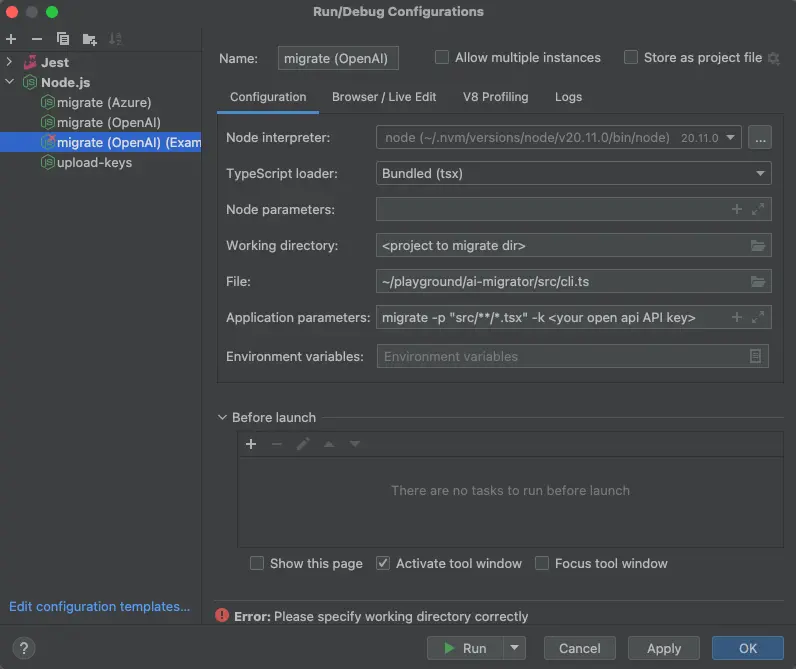

## Tolgee AI migration tool - Development docs
To run this project for debugging purposes, follow these steps:

### 1. Clone and install dependencies

1. Clone the repository

   ```bash
   git clone https://github.com/tolgee/ai-migrator tolgee-ai-migrator
   ```

2. Install dependencies
   ```bash
   cd tolgee-ai-migrator
   npm ci
   ```

### Running the tool
Running the tool is a bit tricky because it has to be run in a different working directory - the migrated project directory. Here are guides for different tools.

#### Running in VSCode
To run it in VSCode, you can use the `.vsdode/launch.json` configuration provided in the repository.

1. Open the project in VSCode
2. Copy the `.vscode/launch.template.json` to `.vscode/launch.json`

   And replace
   - `<your open api API key>` with your OpenAI API key
   - `<project to migrate dir>` with the directory you want to migrate
   - `<your tolgee API key>` with your Tolgee API key

3. Select `Run and Debug` from the left sidebar and run the `Migrate` or `Upload keys` configuration

#### Running in IntelliJ IDEA, WebStorm or other JetBrains IDEs

1. Open the project in the IDE
2. Create a new run configuration according to this image



Similarly, you can configure the upload keys command.

Debugging should work out of the box in both cases.

### Creating a new preset
To create a new preset, you can start by copying the `presets/react` directory to `presets/<preset-name>`. Then, you can
simply modify the `system.handlebars` file to match your needs. The system handlebars file is a prompt template
that is being sent to the ChatGPT.
